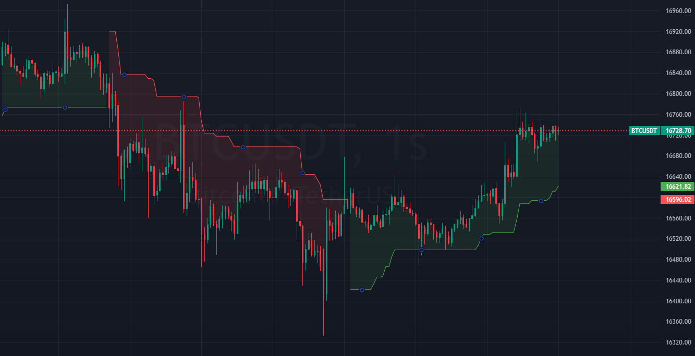

# super-trend
### Super Trend Indicator

Simple Node.js module for calculating SuperTrend
SuperTrend is a trend following indicator that is used to identify the current trend and possible reversals.



## Installation

```bash
npm i node-super-trend
```

## Usage:

```js
// [
// '2018-09-05T00:00:00+0530', // Date In Iso Format
// 741.2, // Open
// 748.95,  // High
// 733.95, // Low
// 740.9, // Close
// 771705 // Volume
// ]
  const SampleData = [
      ["2023-01-02T19:00:00.000Z",16718.3,16732.1,16711.1,16730.5],
      ["2023-01-02T20:00:00.000Z",16730.5,16732,16702.7,16722.8],
      ["2023-01-02T21:00:00.000Z",16722.7,16799,16715,16751.9],
      ["2023-01-02T22:00:00.000Z",16751.9,16755.7,16685.1,16694.6],
      ["2023-01-02T23:00:00.000Z",16694.6,16717.4,16650,16666],
      ["2023-01-03T00:00:00.000Z",16665.9,16699.7,16639.5,16689.1],
      ["2023-01-03T01:00:00.000Z",16689,16689.1,16645.5,16670.5],
      ["2023-01-03T02:00:00.000Z",16670.4,16680,16665.2,16666.5],
      ["2023-01-03T03:00:00.000Z",16666.5,16694,16661.5,16684.5],
      ["2023-01-03T04:00:00.000Z",16684.4,16691.2,16675.2,16678],
      ["2023-01-03T05:00:00.000Z",16677.9,16721.9,16677.7,16720],
      ["2023-01-03T06:00:00.000Z",16720,16774,16717.7,16719.8],
      ["2023-01-03T07:00:00.000Z",16719.8,16726.4,16700.6,16723.1],
      ["2023-01-03T08:00:00.000Z",16723.1,16728.9,16691.7,16710],
      ["2023-01-03T09:00:00.000Z",16710.1,16750.5,16710,16732.9],
      ["2023-01-03T10:00:00.000Z",16732.9,16740.9,16716,16718.3],
      ["2023-01-03T11:00:00.000Z",16718.2,16729.8,16703,16714.2],
      ["2023-01-03T12:00:00.000Z",16714.2,16721.2,16695.7,16703.7],
      ["2023-01-03T13:00:00.000Z",16703.8,16732.2,16703.7,16718.1],
      ["2023-01-03T14:00:00.000Z",16718.2,16764.9,16633,16653.1],
      ["2023-01-03T15:00:00.000Z",16653.1,16674.9,16610,16670.8],
      ["2023-01-03T16:00:00.000Z",16670.9,16680.1,16606,16617.3],
      ["2023-01-03T17:00:00.000Z",16617.3,16637,16600.3,16626],
      ["2023-01-03T18:00:00.000Z",16626.1,16645.8,16621.2,16637.7],
      ["2023-01-03T19:00:00.000Z",16637.6,16652,16615.1,16637.7],
      ["2023-01-03T20:00:00.000Z",16637.6,16665.8,16636,16656.1],
      ["2023-01-03T21:00:00.000Z",16656,16665.7,16652.4,16658.8],
      ["2023-01-03T22:00:00.000Z",16658.8,16673,16642.9,16670.1],
      ["2023-01-03T23:00:00.000Z",16670.2,16688.2,16660.2,16667.2],
      ["2023-01-04T00:00:00.000Z",16667.3,16668.4,16645.7,16655.6],
      ["2023-01-04T01:00:00.000Z",16655.6,16730,16652.3,16696.1],
      ["2023-01-04T02:00:00.000Z",16696.1,16749.8,16695.5,16729],
      ["2023-01-04T03:00:00.000Z",16729.1,16870,16729,16855.9],
      ["2023-01-04T04:00:00.000Z",16855.9,16904.4,16841,16852.4],
      ["2023-01-04T05:00:00.000Z",16852.5,16856.5,16832.3,16848.3],
      ["2023-01-04T06:00:00.000Z",16848.3,16872.9,16842.2,16872.9],
      ["2023-01-04T07:00:00.000Z",16872.8,16885.4,16841.1,16862.5],
      ["2023-01-04T08:00:00.000Z",16862.5,16913.6,16826.7,16857.1],
      ["2023-01-04T09:00:00.000Z",16857.1,16860.4,16824.5,16838.9],
      ["2023-01-04T10:00:00.000Z",16838.9,16840.9,16826.1,16838],
      ["2023-01-04T11:00:00.000Z",16837.9,16847.4,16826.2,16826.8],
      ["2023-01-04T12:00:00.000Z",16826.7,16838.7,16800.1,16808],
      ["2023-01-04T13:00:00.000Z",16808,16829.8,16804.3,16820.1],
      ["2023-01-04T14:00:00.000Z",16820.2,16852.1,16789,16821],
      ["2023-01-04T15:00:00.000Z",16820.9,16850.4,16759.3,16846.5],
      ["2023-01-04T16:00:00.000Z",16846.5,16890.8,16824.3,16850.7],
      ["2023-01-04T17:00:00.000Z",16850.8,16945.6,16841.8,16885.4],
      ["2023-01-04T18:00:00.000Z",16885.4,16980,16864,16942],
      ["2023-01-04T19:00:00.000Z",16941.9,16984.6,16777.7,16835.9],
      ["2023-01-04T20:00:00.000Z",16835.9,16844.2,16820.2,16834.2]
];
```
```js
/**
 * Data = OHLC array of objects
 * Period = Number of periods to calculate
 * Multiplier = Multiplier for the ATR period
 */

const SuperTrend = require('node-super-trend')

const st = new SuperTrend(data, 10, 3).calculate();
```
```js
   Result:
    [
        { trend: 'short', value: 16789.78109803569 },
        { trend: 'short', value: 16789.78109803569 },
        { trend: 'short', value: 16769.00518940891 },
        { trend: 'short', value: 16769.00518940891 },
        { trend: 'short', value: 16769.00518940891 },
        { trend: 'short', value: 16769.00518940891 },
        { trend: 'short', value: 16769.00518940891 },
        { trend: 'short', value: 16769.00518940891 },
        { trend: 'short', value: 16769.00518940891 },
        { trend: 'short', value: 16769.00518940891 },
        { trend: 'short', value: 16769.00518940891 },
        { trend: 'short', value: 16769.00518940891 },
        { trend: 'long', value: 16641.40357329644 },
        { trend: 'long', value: 16711.393215966797 },
        { trend: 'long', value: 16711.393215966797 },
        { trend: 'long', value: 16711.393215966797 },
        { trend: 'long', value: 16718.197754439792 },
        { trend: 'long', value: 16718.197754439792 },
        { trend: 'long', value: 16718.197754439792 },
        { trend: 'long', value: 16718.197754439792 },
        { trend: 'long', value: 16718.197754439792 },
        { trend: 'long', value: 16718.197754439792 },
        { trend: 'long', value: 16718.197754439792 },
        { trend: 'long', value: 16718.197754439792 },
        { trend: 'long', value: 16718.197754439792 },
        { trend: 'long', value: 16718.197754439792 },
        { trend: 'long', value: 16725.994313089133 },
        { trend: 'long', value: 16736.264881780222 },
        { trend: 'long', value: 16736.264881780222 },
        { trend: 'long', value: 16736.264881780222 }

    ]
```

# License (MIT)
